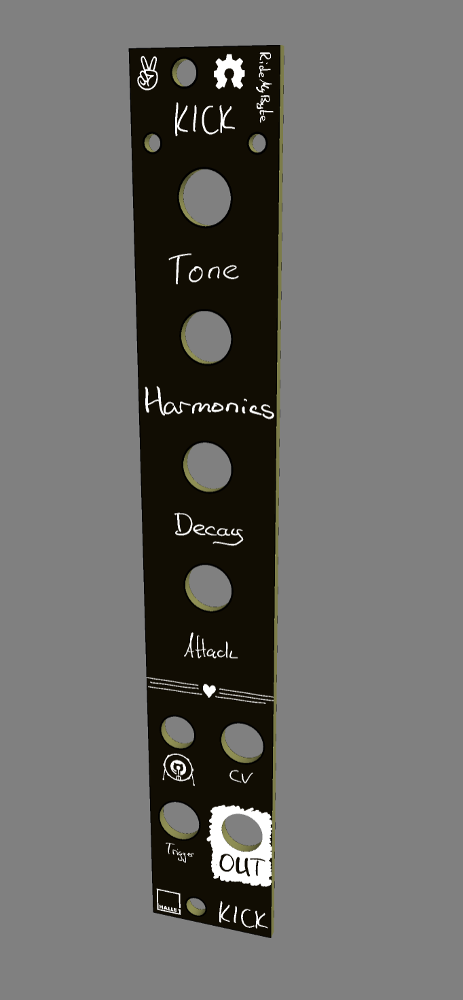
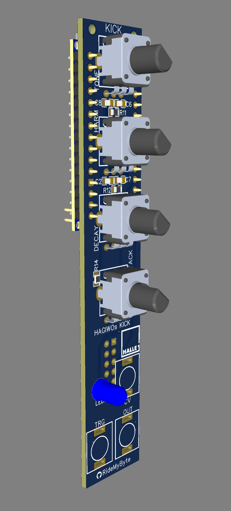
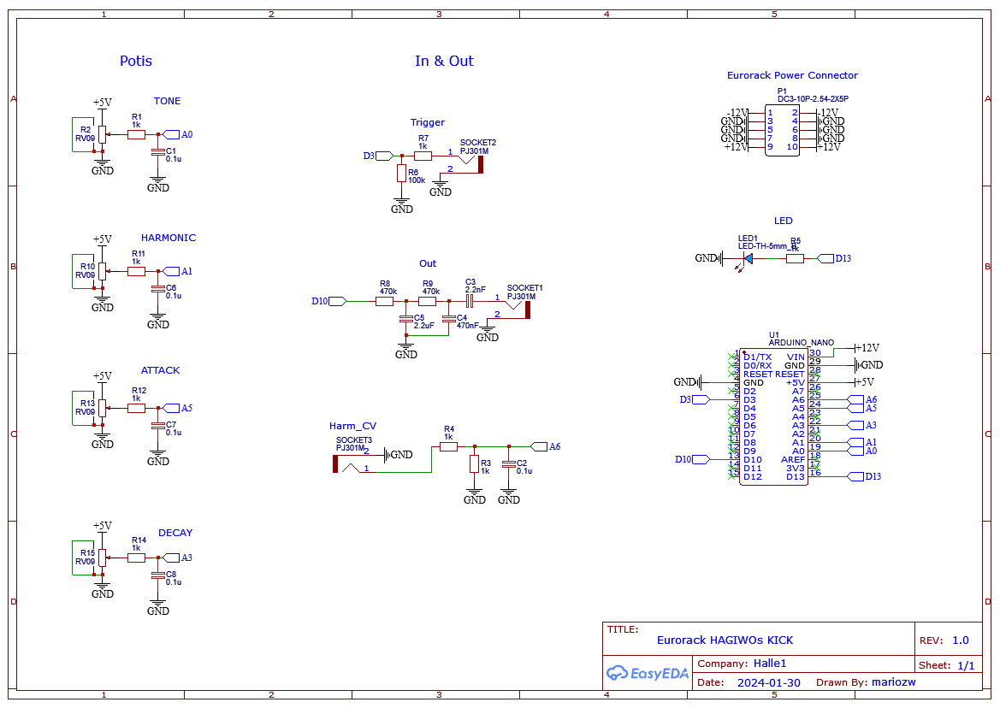

# Eurorack-NanoKick
The modular synthesizer kick drum module is developed using Arduino programming and aims to replicate the Roland TR kicks, specifically the MS-20mini kick. Resonance modulation is key to achieving the desired distortion. The user interface includes four knobs controlling pitch, harmonics, decay, and attack. Powered by a single 5V or 12V supply, it features TRIGGER IN for kick triggering and an audio OUT ranging from -2.5 to +2.5V. Distortion is achieved through PWM control, eliminating the need for a Transistor-VCA circuit. A diode clip introduces distortion, while a 2-pole passive filter cuts undesirable high-frequency components for a clear sound. The high-speed PWM maintains low output impedance. The result is a compact, affordable module catering to musicians and synth enthusiasts with precise control and unique distortion capabilities.

## STATUS
Problems, nothing is heard, PCB error? Currently no time for debugging. Updates will follow.  

## Source
The code and circuitry originate from [HAGIWO](https://note.com/solder_state/n/ne33e32660d50).

## My Part
I've contributed by designing the PCB, creating the front panel, ensuring a clean layout, and providing a Bill of Materials (BOM). The intention is to simplify the replication of these modules for others.

## How to use
Download the Gerber files and order the boards from JLCPCB / PCBWay or others. Order the components from the BOM and solder them by hand. I chose 0805 SMD components because they are still easy to solder by hand. 

## Customize
You can simply redesign the front PCB for visual adjustments. 
To do this, log in to EasyEDA, upload the PCB/EasyEDA_PCB_FrontPlate.json and customize the "board". There are no components on the board. Only the holes and dimensions have to fit. Have fun!

## Images
 

## Schematic

